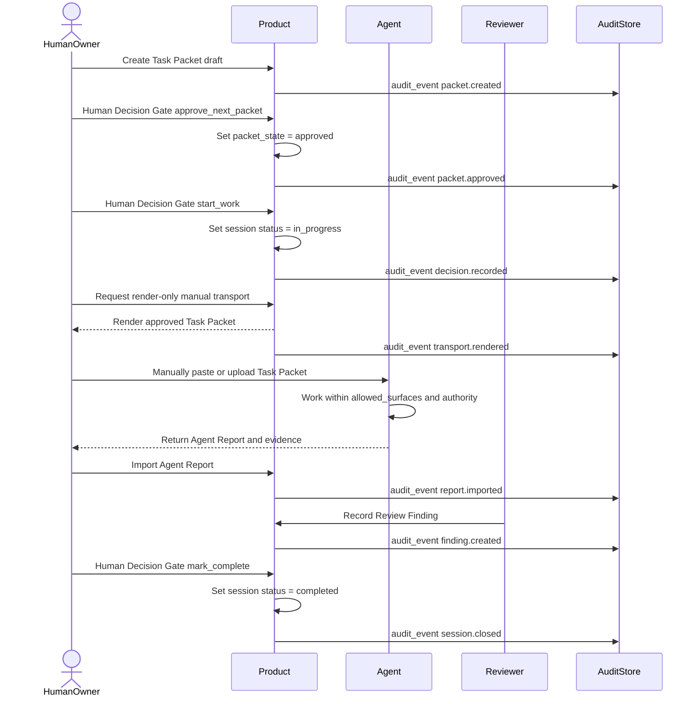
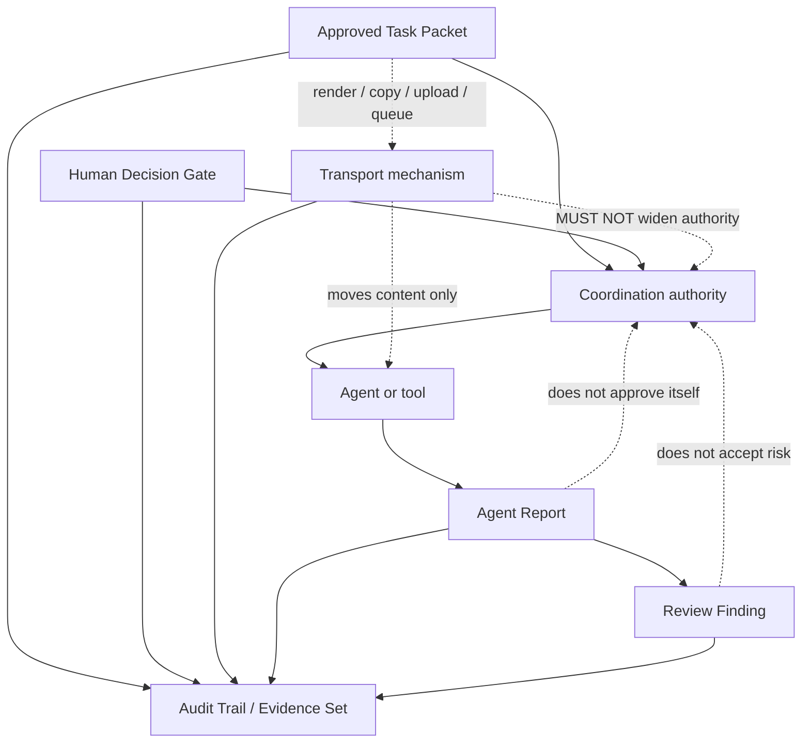
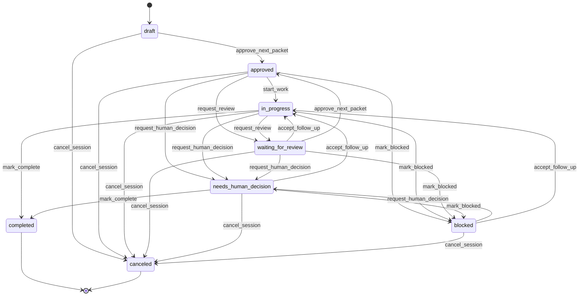
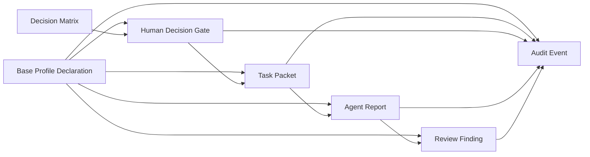

# HACP v0.1 Diagrams

These diagrams are non-normative reading aids for the HACP v0.1 working draft.
The RFCs, schemas, base profile declaration, and decision matrix remain the
normative draft artefacts.

## Minimal Lifecycle

This sequence shows the small end-to-end flow used by the minimal example:
packet creation, human approval, manual transport, report import, review
finding, completion, and audit evidence.



## Authority Boundary

This diagram shows the core HACP invariant: authority comes from the approved
Task Packet and Human Decision Gate records. Transport moves content, and
reports/findings add evidence; they do not create approval.



## Base Decision Matrix

This state diagram mirrors the base Human Decision Gate transition matrix in
[decision-matrix-base-v0.1.yaml](decision-matrix-base-v0.1.yaml). The YAML file
is the canonical machine-readable source.

This block is generated from the YAML matrix. After editing
`decision-matrix-base-v0.1.yaml`, run:

```bash
python3 scripts/generate_decision_matrix_mermaid.py
```

To check for drift without modifying files, run:

```bash
python3 scripts/generate_decision_matrix_mermaid.py --check
```

<!-- BEGIN GENERATED DECISION MATRIX -->

<!-- END GENERATED DECISION MATRIX -->

## Core Record Relationships

This is a compact relationship map, not a full schema diagram. It keeps the
record model readable while showing which records constrain or review each
other.


