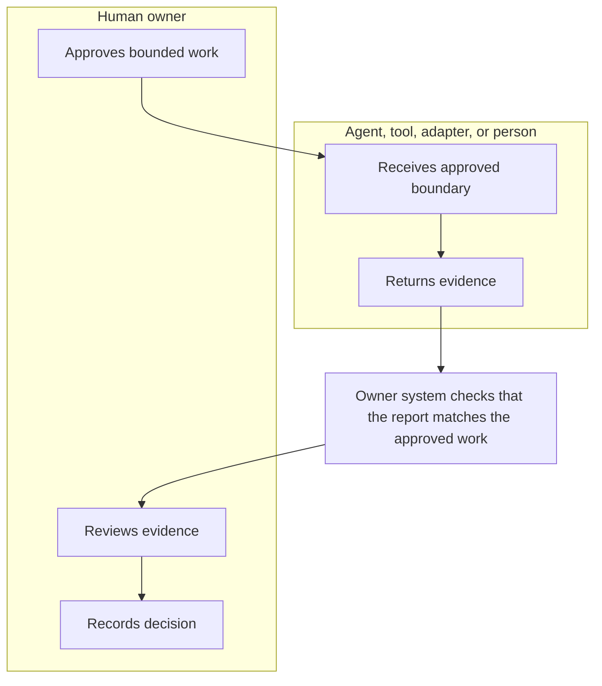
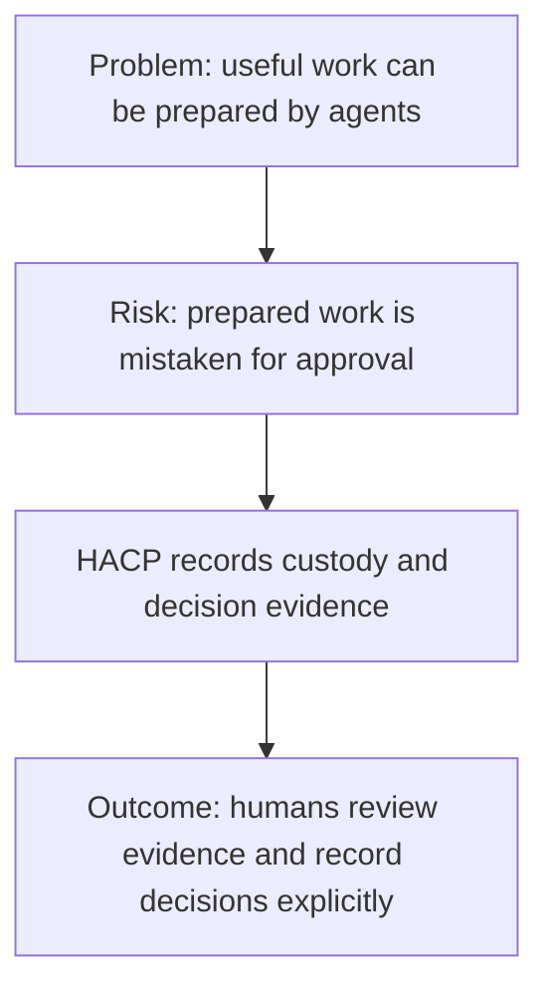
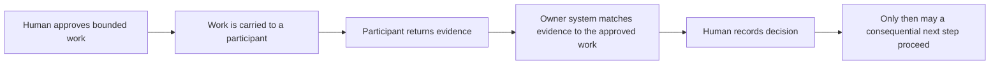
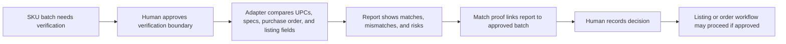
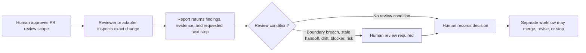

# HACP Use Cases

Status: explanatory material. This page is not a conformance requirement.

This page explains why HACP exists before introducing protocol details. It is
not a conformance target, schema extension, runtime requirement, or prompt
standard.

HACP is useful when agents, tools, or humans can do bounded work, but a
consequential next step still needs explicit human approval.

The core idea is simple:

> Reports are evidence, not authorization.

## Terms Used In These Examples

- **Bounded work** means work with an explicit, human-approved scope that the
  participant is not allowed to exceed.
- **Owner system** means the human owner's receiving system or review surface
  that verifies custody and records decisions. It is distinct from the adapter
  or participant that performed the bounded work.
- **Authority** means the approved scope of work. It does not mean the adapter
  has runtime permission to take consequential action.
- **Consequential state change** means accepting work, marking work complete,
  canceling work, requesting revision, granting additional authority, changing
  review posture, or another profile-defined action that should require human
  approval.
- **Matrix drift** means the decision rules visible at review time differ from
  the decision rules captured when the handoff or report was created.

HACP records the decision. A separate product, workflow, or human-controlled
process may act on that decision.

## The Short Version

HACP is for teams that want help from agents and tools without turning every
agent recommendation into automatic authority.

Without HACP, a human may be left asking:

- What exactly did I approve?
- Which agent, tool, or person received that approved work?
- Is this report tied to the approved work, or to a stale chat/thread/file?
- Did the participant stay inside the approved boundary?
- What risks, boundary breaches, stale handoffs, or rule drift were visible
  when the human made the decision?
- Who accepted, rejected, revised, canceled, or completed the work?

HACP answers those questions with records instead of memory, screenshots, or
trust in a chat transcript.

## The Human Problem

Most teams do not only need an agent to do work. They need a reliable way for a
human to approve boundaries, review evidence, and decide what happens next.

Today that coordination is often spread across prompts, chat logs, pull request
comments, spreadsheets, ticket notes, screenshots, and memory. That works for a
small demo. It gets fragile when the work affects customers, money, product
records, executive attention, production systems, or compliance-sensitive
decisions.

HACP gives that coordination a small, checkable shape:

## When HACP Fits

HACP is a good fit when all of these are true:

- a human wants to delegate bounded work;
- the work may be performed by an agent, tool, adapter, or human participant;
- the output may influence a consequential next step;
- the organization needs evidence of what was approved, what came back, and who
  decided;
- stale work, boundary breaches, matrix drift, blocked stop conditions, or
  residual risk should route back to human review.

HACP is probably not needed when:

- the work has no consequence beyond a local draft or throwaway experiment;
- a normal log line is enough evidence;
- no human approval boundary is required;
- the team only needs a model API, command runner, queue, or prompt template.

An adapter may compare data, draft a recommendation, verify a change, or request
a next step. HACP records the approved work boundary, the returned evidence, the
match between report and authority, and the human decision. It does not make the
decision for the human.

## Common Pattern

Most HACP workflows follow the same shape:

1. A human approves a bounded work packet.
2. The packet is carried to an agent, tool, adapter, or human workflow
   participant.
3. The participant returns structured evidence.
4. The returned work is matched to the approved packet.
5. A human records a decision such as accept follow-up, mark complete, request
   revision, reject report, cancel session, or request continued human review.

The examples below map ordinary workflow language to HACP 0.2 records. They do
not require a specific model, queue, database, user interface, prompt format, or
transport mechanism.

In these examples, HACP 0.2 core does not let the owner system approve
consequential next steps on its own; those steps still require human decision
records.

## Use Case Summary

| Use case | Human pain without HACP | How HACP helps |
| --- | --- | --- |
| Product listing verification | A tool can find mismatches, but humans still need to know whether the exact approved SKU batch was checked before a listing or order proceeds. | You can prove which SKUs were checked, what exceptions were found, and who approved the next step. |
| Executive routing gate | Assistants can draft summaries, but routing something to an executive can consume attention or imply priority. | The summary can be prepared without automatically escalating the issue. |
| Assistant task queue | Tasks move between people, tools, and agents, but completion and escalation can drift across notes. | The queue can show what was delegated, what came back, and which human decision changed the task state. |
| Marketing or competitive analysis | Research recommendations can accidentally become action pressure: publish, contact, update, or campaign-change. | Research stays useful but advisory until a human accepts follow-up. |
| Software review and change gates | Agents can review or propose fixes, but the human needs proof of scope, risks, and exact work reviewed. | A reviewer can see what was approved, what was inspected, and what risks were visible before deciding. |

## Product Listing Verification

A product team needs to verify that UPCs, vendor specifications, ordered
quantities, marketplace attributes, and listing data match before a product goes
live or an order proceeds.

Without HACP, the team may know a tool produced a comparison, but not whether it
checked the exact approved SKU batch or whether exceptions were visible when the
listing moved forward.

An agent or tool can compare the data and return matches, mismatches, missing
fields, confidence notes, and residual risk. A human reviewer still decides
whether to approve the listing, request correction, reject the report, or
escalate the issue.

| HACP concept | Product verification example |
| --- | --- |
| Authority packet | "Verify these SKUs against purchase order, UPC, vendor specs, and marketplace listing requirements." |
| Handoff package | The approved work boundary is made available to a product-verification adapter. |
| Adapter report | The adapter returns matched fields, mismatches, evidence, unresolved risks, and an advisory requested next step. |
| Match proof | The owner system proves the report belongs to the exact approved SKU batch and handoff. |
| Human decision record | A product team member accepts follow-up, marks complete, requests revision, rejects the report, cancels the session, or requests continued human review. |
| Consequential state change | Only after approval does the product move toward listing, order approval, synchronization, or another downstream business state. |

HACP is useful here because one human can review evidence and exceptions instead
of manually rechecking every field from scratch, while the product still does
not move forward without a recorded human decision.

## Executive Routing Gate

Some work can be prepared by an agent, employee, or assistant, but routing it to
an executive or high-value reviewer should not be automatic. The organization
may need a human gate before the request consumes attention, changes priority,
or carries authority.

Without HACP, a polished summary can look like an approved escalation even when
the human only asked for preparation.

| HACP concept | Executive routing example |
| --- | --- |
| Authority packet | "Prepare a concise routing packet for this issue, limited to these facts and requested decision options." |
| Handoff package | The approved packet is carried to a summarization or triage participant. |
| Adapter report | The participant returns the proposed summary, routing reason, risk notes, and requested next step. |
| Match proof | The owner system links the summary back to the exact approved packet. |
| Human decision record | A human accepts follow-up, rejects the report, requests revision, cancels the session, or requests continued human review. |
| Consequential state change | Only after approval does the workflow route the work to the executive or change its escalation posture. |

HACP is useful here because the preparation work can be assisted, while the
attention-routing decision remains explicit and reviewable.

## Assistant Task Queue

An assistant may manage a queue of tasks where some work is handled by people,
some by tools, and some by AI. The queue may include due dates, priority, risk,
evidence, review conditions, and handoffs between participants.

Without a recorded decision boundary, "done," "blocked," "needs revision," and
"send to the next participant" can become ambiguous status labels instead of
explicit human decisions.

| HACP concept | Assistant queue example |
| --- | --- |
| Authority packet | "Review this task, gather the requested evidence, and stay within these boundaries." |
| Handoff package | The approved task boundary is made available to the next participant. |
| Adapter report | The participant returns findings, status, blockers, residual risks, and a requested next step. |
| Match proof | The owner system proves the report belongs to the approved task and handoff. |
| Human decision record | The assistant or owner accepts follow-up, marks complete, requests revision, rejects the report, cancels the session, or requests continued human review. |
| Consequential state change | Only after approval does the task become complete, escalate, change ownership, or move to another review posture. |

HACP is useful here because AI can complete bounded work inside the queue, but
the human remains the decision gate for completion, escalation, and authority
changes.

## Marketing or Competitive Analysis

An agent can gather competitor research, summarize changes, draft options, and
recommend follow-up actions. Those outputs may be useful, but they should not by
themselves publish content, contact customers, email vendors, or change a live
asset.

Without HACP, a research recommendation can be mistaken for approval to act on
the recommendation.

| HACP concept | Marketing or research example |
| --- | --- |
| Authority packet | "Analyze these competitors and identify notable changes; do not contact anyone or change live assets." |
| Handoff package | The approved research boundary is carried to a research adapter. |
| Adapter report | The adapter returns evidence, sources, summary, risks, and advisory recommendations. |
| Match proof | The owner system links the report to the exact approved research request. |
| Human decision record | A human accepts follow-up, marks complete, requests revision, rejects the report, cancels the session, or requests continued human review. |
| Consequential state change | Only after approval does a separate workflow proceed toward outreach, publishing, campaign changes, or business-record updates. |

HACP is useful here because research and recommendation can scale without
turning recommendations into automatic action.

## Software Review and Change Gates

An agent can review a pull request, inspect tests, summarize risks, or propose a
bounded fix. The report can help a developer decide what to do next, but it
should not silently widen authority or approve a consequential change by itself.

Without HACP, it can be hard to prove which scope was approved, which change was
reviewed, and which risks the human saw before accepting follow-up work.

| HACP concept | Software review example |
| --- | --- |
| Authority packet | "Review this change for the listed risks and propose bounded fixes; do not modify unrelated areas." |
| Handoff package | The approved review boundary is carried to a reviewer, tool, or agent. |
| Adapter report | The participant returns findings, evidence, suggested fixes, verification notes, and residual risks. |
| Match proof | The owner system links the report to the exact approved review request. |
| Human decision record | A human accepts follow-up, marks complete, requests revision, rejects the report, cancels the session, or requests continued human review. |
| Consequential state change | Only after approval does a separate implementation, merge, release, or follow-up workflow proceed. |

HACP is useful here because agents can help with review and remediation while
the human still owns scope, risk acceptance, and ship/no-ship decisions.

## What HACP Changes in Practice

HACP makes delegation more accountable.

Before HACP, a team may have:

- a chat prompt that says what the human wanted;
- a tool output that says what happened;
- a reviewer comment that says whether it looked okay;
- a human memory of whether this was approved.

With HACP, the same workflow can preserve:

- the approved authority packet;
- the handoff package that carried that authority;
- the adapter report that returned evidence;
- the match proof tying the report to the approved handoff;
- the human decision record that authorizes the next consequential step.

That does not remove human judgment. It gives human judgment a durable trail.

## What These Examples Do Not Mean

These examples do not mean HACP itself:

- runs tools, shells, CLIs, or verification commands;
- calls models or defines prompt formats;
- sends emails, routes messages, publishes listings, ships orders, merges code,
  deploys software, or changes live records;
- replaces the human decision gate;
- requires a specific product UI, message bus, database, or automation stack.

HACP defines custody and approval records around bounded work. Profiles and
implementations may define how records are carried, displayed, verified, and
stored, but the base protocol keeps reports as evidence and consequential next
steps under explicit human approval.
